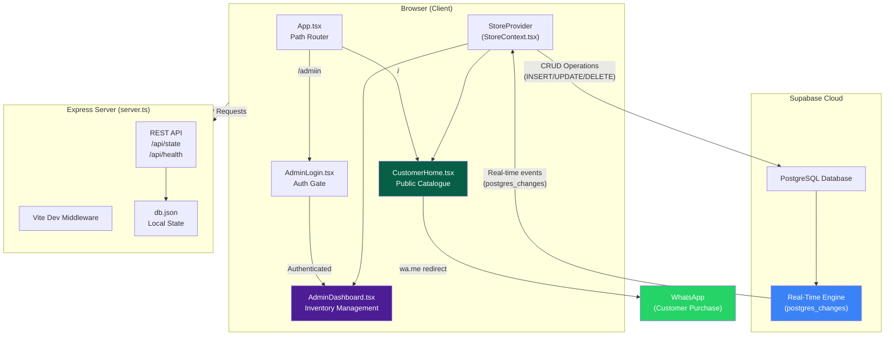
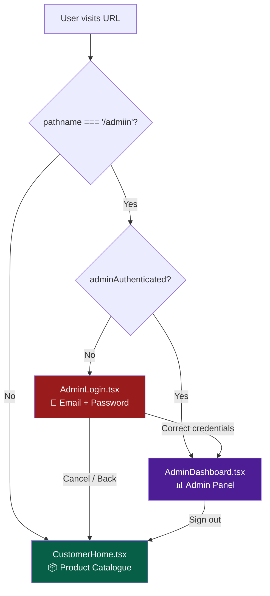
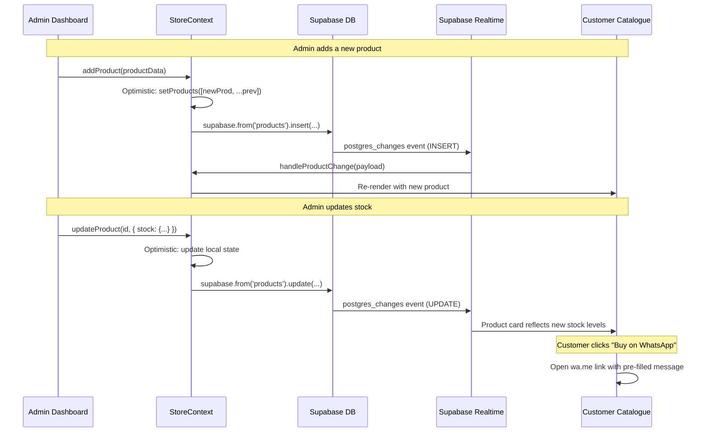
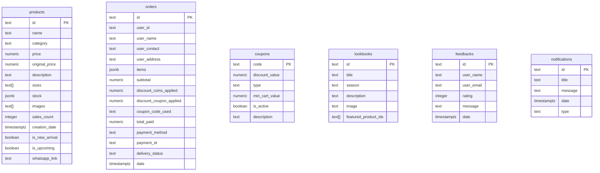

# Label Swati — Project Documentation & System Architecture

> **Last Updated:** 2026-06-16  
> **Status:** Catalogue-only storefront with admin inventory management  
> **Live Dev Server:** `http://localhost:3000`

---

## Table of Contents

1. [Project Overview](#project-overview)
2. [Tech Stack](#tech-stack)
3. [Directory Structure](#directory-structure)
4. [System Architecture](#system-architecture)
5. [Routing & Navigation](#routing--navigation)
6. [Data Flow & Real-Time Sync](#data-flow--real-time-sync)
7. [Database Schema (Supabase)](#database-schema-supabase)
8. [Component Hierarchy](#component-hierarchy)
9. [File-by-File Reference](#file-by-file-reference)
10. [StoreContext API Reference](#storecontext-api-reference)
11. [TypeScript Interfaces](#typescript-interfaces)
12. [Environment Variables](#environment-variables)
13. [Scripts & Commands](#scripts--commands)
14. [Deployment](#deployment)
15. [WhatsApp Integration](#whatsapp-integration)
16. [Admin Credentials](#admin-credentials)
17. [Refactoring History](#refactoring-history)

---

## Project Overview

**Label Swati** is a luxury sustainable fashion brand website built as a **catalogue-only storefront** with an internal **admin dashboard** for inventory and order management.

### Core Principles

- **No customer login/signup** — the website is purely a product catalogue
- **WhatsApp-first purchasing** — every product has a "Buy on WhatsApp" button that redirects the customer to WhatsApp with a pre-filled message expressing interest
- **Real-time admin sync** — any changes made in the admin dashboard (add/edit/delete products, stock adjustments) are **instantly reflected** on the public catalogue via Supabase real-time subscriptions
- **Minimal, luxury aesthetics** — stone/neutral palette with purple and orange accent gradients, mono-spaced type accents

---

## Tech Stack

| Layer             | Technology                                                                 |
| ----------------- | -------------------------------------------------------------------------- |
| **Framework**     | React 19 + TypeScript 5.8                                                  |
| **Bundler**       | Vite 6                                                                     |
| **Styling**       | Tailwind CSS 4 (via `@tailwindcss/vite` plugin)                            |
| **Animations**    | Motion (Framer Motion) — `motion/react`                                    |
| **Icons**         | Lucide React                                                               |
| **Charts**        | Recharts (admin analytics)                                                 |
| **Database**      | Supabase (PostgreSQL + Real-time subscriptions)                            |
| **Server**        | Express.js + Vite middleware (dev), static file serving (prod)             |
| **Runtime**       | Node.js, tsx (dev transpiler)                                              |
| **Deployment**    | Vercel (SPA rewrites configured via `vercel.json`)                         |

---

## Directory Structure

```
Label-Swati/
├── public/
│   └── logo.jpg                    # Brand logo (used in header)
├── src/
│   ├── components/
│   │   ├── AdminDashboard.tsx      # Full admin panel (inventory, analytics, orders, coupons)
│   │   ├── AdminLogin.tsx          # Admin authentication gate (hardcoded credentials)
│   │   └── CustomerHome.tsx        # Public catalogue storefront with WhatsApp CTA
│   ├── context/
│   │   └── StoreContext.tsx        # Central state management + Supabase sync + real-time
│   ├── App.tsx                     # Root component — path-based routing
│   ├── main.tsx                    # React DOM entry point
│   ├── supabase.ts                 # Supabase client initialization
│   ├── types.ts                    # TypeScript interfaces (Product, Order, Coupon, etc.)
│   ├── index.css                   # Tailwind CSS import
│   └── vite-env.d.ts               # Vite type declarations
├── .env                            # Supabase URL + Anon Key (gitignored)
├── .env.example                    # Template for environment variables
├── db.json                         # Local fallback/state-sync JSON (Express API)
├── index.html                      # HTML shell (Vite SPA entry)
├── package.json                    # Dependencies and scripts
├── schema.sql                      # Supabase PostgreSQL DDL
├── server.ts                       # Express server with Vite dev middleware
├── tsconfig.json                   # TypeScript configuration
├── vercel.json                     # Vercel SPA rewrite rules
└── vite.config.ts                  # Vite + Tailwind + React plugin config
```

---

## System Architecture



### Architecture Summary

1. **Single-Page Application (SPA)** — React renders the entire UI client-side
2. **Path-based routing** — `window.location.pathname` determines which view to show (no React Router needed)
3. **`StoreProvider` wraps everything** — provides products, orders, coupons, lookbooks, feedbacks, and notifications to all child components
4. **Supabase is the single source of truth** — all mutations go to Supabase first, with optimistic local state updates
5. **Real-time subscriptions** — `StoreContext` subscribes to `postgres_changes` on all tables, so admin changes propagate to all connected clients instantly
6. **Express server** is used for development (Vite middleware with SPA routing fallback to support direct page reloads/navigation) and has a simple `db.json` state API for local persistence fallback

---

## Routing & Navigation



### Route Table

| Path       | Component           | Access      | Description                                     |
| ---------- | ------------------- | ----------- | ----------------------------------------------- |
| `/`        | `CustomerHome`      | Public      | Product catalogue with filters and WhatsApp CTAs |
| `/admiin`  | `AdminLogin` → `AdminDashboard` | Protected (hardcoded creds) | Inventory management, analytics, orders, coupons |

> **Note:** The admin route is intentionally `/admiin` (double-i) — this is by design, not a typo. It acts as a simple obscurity layer, and matches both `/admiin` and `/admiin/` (with a trailing slash).

### Navigation Flow (Code-Level)

```
App.tsx
├── useState: currentPath (tracks window.location.pathname)
├── useState: adminAuthenticated (tracks admin session)
├── useEffect: listens to 'popstate' for browser back/forward
│
├── if currentPath === '/admiin' or '/admiin/':
│   ├── if adminAuthenticated → <AdminDashboard />
│   └── else → <AdminLogin />
│
└── else → <CustomerHome />
```

**Key navigation functions in `App.tsx`:**

| Function                    | Action                                                 |
| --------------------------- | ------------------------------------------------------ |
| `handleNavigateToCustomer`  | Sets `adminAuthenticated = false`, pushes `/` to history |
| `handleAdminLoginSuccess`   | Sets `adminAuthenticated = true`                        |

---

## Data Flow & Real-Time Sync



### Sync Channels (Real-Time Subscriptions)

The `StoreContext` subscribes to Supabase real-time on a single channel (`store-realtime-channel`) covering these tables:

| Table           | Events Tracked    | Effect on Frontend                                 |
| --------------- | ----------------- | -------------------------------------------------- |
| `products`      | INSERT, UPDATE, DELETE | Catalogue grid updates instantly                  |
| `orders`        | INSERT, UPDATE, DELETE | Admin order panel updates                         |
| `coupons`       | INSERT, UPDATE, DELETE | Coupon list in admin updates                      |
| `feedbacks`     | INSERT, UPDATE, DELETE | Feedback list updates                             |
| `notifications` | INSERT, UPDATE, DELETE | Toast notifications can appear on storefront      |

---

## Database Schema (Supabase)



All tables have **Supabase Realtime enabled** via:
```sql
ALTER PUBLICATION supabase_realtime ADD TABLE public.<table_name>;
```

---

## Component Hierarchy

```
<StrictMode>
  <App>
    <StoreProvider>                              ← Central state + Supabase sync
      ├── <CustomerHome />                       ← Route: /
      │   ├── Toast Notification (AnimatePresence)
      │   ├── Header (logo + WhatsApp CTA)
      │   ├── Lookbook Spotlight Banner
      │   ├── Sidebar Filters
      │   │   ├── Brand Profile Card
      │   │   ├── Category Filter
      │   │   ├── Size Filter
      │   │   └── Price Range Slider
      │   ├── Product Catalogue Grid
      │   │   └── Product Card × N
      │   │       ├── Image + Badges (NEW ARRIVAL / OUT OF STOCK)
      │   │       ├── Quick View Button
      │   │       └── "Buy on WhatsApp" Button
      │   └── Product Detail Modal (AnimatePresence)
      │       ├── Image Gallery Slideshow
      │       ├── Product Specs (description, stock)
      │       └── "Buy on WhatsApp" CTA
      │
      ├── <AdminLogin />                         ← Route: /admiin (unauthenticated)
      │   └── Email + Password form
      │
      └── <AdminDashboard />                     ← Route: /admiin (authenticated)
          ├── Sidebar Navigation
          │   ├── Analytics Tab
          │   ├── Products & Inventory Tab
          │   ├── Orders & Fulfillment Tab
          │   └── Coupons Tab
          ├── Analytics View
          │   ├── KPI Cards (revenue, units, orders, products)
          │   ├── Revenue Chart (Recharts)
          │   └── Sales by Category (PieChart)
          ├── Products & Inventory View
          │   ├── Add New Product Form
          │   └── Products Table (edit stock, delete, change image)
          ├── Orders & Fulfillment View
          │   └── Order cards with delivery status dropdown
          └── Coupons View
              ├── Generate Coupon Form
              └── Coupons Table
    </StoreProvider>
  </App>
</StrictMode>
```

---

## File-by-File Reference

### Root Files

| File             | Purpose                                                                          |
| ---------------- | -------------------------------------------------------------------------------- |
| `index.html`     | SPA shell — mounts React at `<div id="root">`                                  |
| `server.ts`      | Express server: Vite dev middleware + `/api/state` REST API + `db.json` sync     |
| `schema.sql`     | Supabase PostgreSQL DDL for all tables + real-time publication                    |
| `package.json`   | Dependencies, scripts (`dev`, `build`, `start`, `lint`)                          |
| `vite.config.ts` | Vite config with React + Tailwind plugins, path aliases, HMR toggle             |
| `vercel.json`    | SPA rewrite rule: all paths → `index.html`                                      |
| `.env`           | `VITE_SUPABASE_URL` and `VITE_SUPABASE_ANON_KEY`                                |
| `db.json`        | Local JSON file for Express state API (fallback persistence)                     |
| `tsconfig.json`  | TypeScript configuration                                                         |

### Source Files (`src/`)

| File                               | Lines | Purpose                                                      |
| ---------------------------------- | ----- | ------------------------------------------------------------ |
| `main.tsx`                         | 11    | React DOM render entry point                                  |
| `App.tsx`                          | 51    | Path-based router: `/` → catalogue, `/admiin` → admin        |
| `supabase.ts`                      | 14    | Supabase client init from env vars                            |
| `types.ts`                         | 76    | TypeScript interfaces (Product, Order, Coupon, etc.)          |
| `index.css`                        | 2     | Tailwind CSS import                                           |
| `context/StoreContext.tsx`         | ~723  | Central state, Supabase CRUD, real-time subscriptions, defaults |
| `components/CustomerHome.tsx`      | ~450  | Public catalogue with filters, lookbook, WhatsApp buttons     |
| `components/AdminDashboard.tsx`    | ~1155 | Full admin panel: analytics, products, orders, coupons        |
| `components/AdminLogin.tsx`        | 188   | Admin credential form with gradient UI                        |

---

## StoreContext API Reference

### State (Read-Only)

| Property        | Type                            | Description                                 |
| --------------- | ------------------------------- | ------------------------------------------- |
| `products`      | `Product[]`                     | All products in catalogue                    |
| `orders`        | `Order[]`                       | All customer orders (managed by admin)       |
| `coupons`       | `Coupon[]`                      | Active/inactive coupon codes                 |
| `lookbooks`     | `SeasonalLookbook[]`            | Seasonal campaign banners (hardcoded)        |
| `feedbacks`     | `UserFeedback[]`                | Customer feedback entries                    |
| `notifications` | `{ id, title, message, date, type }[]` | Admin-triggered alerts                |
| `isLoading`     | `boolean`                       | True during initial Supabase bootstrap       |

### Actions (Admin Operations)

| Method                     | Params                                               | Description                                    |
| -------------------------- | ---------------------------------------------------- | ---------------------------------------------- |
| `addProduct`               | `Omit<Product, 'id' \| 'salesCount' \| 'creationDate'>` | Add new product to catalogue + Supabase    |
| `updateProduct`            | `(id: string, updated: Partial<Product>)`            | Update any product field (price, stock, etc.)   |
| `deleteProduct`            | `(id: string)`                                       | Remove product from catalogue + Supabase        |
| `addUpcomingCoupon`        | `(coupon: Coupon)`                                   | Create a new coupon code                        |
| `deleteCoupon`             | `(code: string)`                                     | Delete a coupon code                            |
| `addFeedback`              | `(userName, userEmail, rating, message)`              | Submit anonymous customer feedback              |
| `triggerSaleNotification`  | `(title, message, type?)`                            | Push a new notification to all clients          |
| `updateOrderStatus`        | `(orderId, status)`                                  | Change order delivery status                    |

### Bootstrap Flow

1. On mount, check if Supabase `products` table is empty
2. If empty → seed all default data (products, coupons, feedbacks, notifications)
3. Fetch all tables from Supabase
4. If Supabase fails → fall back to hardcoded defaults
5. Subscribe to real-time channel on all tables
6. Set `isLoading = false`

---

## TypeScript Interfaces

### Product
```typescript
interface Product {
  id: string;
  name: string;
  category: string;           // "Dresses", "Tees", "Coats", "Knitwear", "Trousers"
  price: number;
  originalPrice?: number;     // For showing discounted prices
  description: string;
  sizes: string[];            // ["S", "M", "L", "XL", "XXL"]
  stock: Record<string, number>; // { "S": 8, "M": 5, "L": 2 }
  images: string[];           // Array of image URLs (gallery slideshow)
  salesCount: number;
  creationDate: string;       // ISO 8601
  isNewArrival?: boolean;
  isUpcoming?: boolean;       // Hidden from public catalogue
  whatsappLink?: string;      // URL to the product on WhatsApp Catalogue
}
```

### Order
```typescript
interface Order {
  id: string;
  userId: string;
  userName: string;
  userContact: string;
  userAddress: string;
  items: OrderItem[];
  subtotal: number;
  discountCoinsApplied: number;
  discountCouponApplied: number;
  couponCodeUsed?: string;
  totalPaid: number;
  paymentMethod: 'Credit/Debit Card' | 'Digital Wallet' | 'UPI/Net Banking' | 'COD';
  paymentId: string;
  deliveryStatus: 'Pending' | 'Shipped' | 'Delivered';
  date: string;
}
```

### OrderItem
```typescript
interface OrderItem {
  productId: string;
  productName: string;
  productImage: string;
  size: string;
  quantity: number;
  priceAtPurchase: number;
}
```

### Coupon
```typescript
interface Coupon {
  code: string;
  discountValue: number;
  type: 'percent' | 'flat';
  minCartValue: number;
  isActive: boolean;
  description: string;
}
```

### SeasonalLookbook
```typescript
interface SeasonalLookbook {
  id: string;
  title: string;
  season: string;
  description: string;
  image: string;
  featuredProductIds: string[];
}
```

### UserFeedback
```typescript
interface UserFeedback {
  id: string;
  userName: string;
  userEmail: string;
  rating: number;         // 1-5
  message: string;
  date: string;
}
```

---

## Environment Variables

| Variable                  | Required | Description                         |
| ------------------------- | -------- | ----------------------------------- |
| `VITE_SUPABASE_URL`      | Yes      | Supabase project URL                |
| `VITE_SUPABASE_ANON_KEY` | Yes      | Supabase anonymous/public API key   |
| `DISABLE_HMR`            | No       | Set to `"true"` to disable Vite HMR |

**.env file format:**
```env
VITE_SUPABASE_URL="https://xxxxx.supabase.co"
VITE_SUPABASE_ANON_KEY="eyJhbGciOi..."
```

---

## Scripts & Commands

| Script            | Command                    | Description                                          |
| ----------------- | -------------------------- | ---------------------------------------------------- |
| `npm run dev`     | `tsx server.ts`            | Start dev server with Vite HMR on port 3000          |
| `npm run build`   | `vite build && esbuild...` | Production build (client + server bundle)             |
| `npm run start`   | `node dist/server.cjs`     | Run production server                                |
| `npm run preview` | `vite preview`             | Preview production build                             |
| `npm run lint`    | `tsc --noEmit`             | TypeScript type checking (no output)                 |
| `npm run clean`   | `rm -rf dist server.js`    | Clean build artifacts                                |

---

## Deployment

### Vercel (Current Setup)

The project includes a `vercel.json` with SPA rewrites:
```json
{
  "rewrites": [
    { "source": "/(.*)", "destination": "/index.html" }
  ]
}
```

This ensures all routes (including `/admiin`) are handled by the React SPA. In production on Vercel:
- `vite build` generates static files in `dist/`
- Vercel serves static files and rewrites all paths to `index.html`
- The Express server (`server.ts`) is NOT used in Vercel — Supabase handles all data persistence

### Express Server (Local/Self-Hosted)

For local development or self-hosting:
- `npm run dev` → Express with Vite middleware on port 3000
- `npm run build && npm run start` → Express serves static `dist/` folder
- The Express `/api/state` endpoint reads/writes to `db.json` (not critical — Supabase is primary)

---

## WhatsApp Integration

### How It Works

Every product in the catalogue has a **"Buy on WhatsApp"** button. When clicked, it:

1. Generates a `wa.me` URL with the brand's phone number
2. Pre-fills a message with the product name, price, and catalogue URL
3. Opens WhatsApp (or WhatsApp Web) in a new tab

### Configuration

In `CustomerHome.tsx`:
```typescript
const WHATSAPP_NUMBER = '91XXXXXXXXXX';  // ← Replace with actual brand number

const getWhatsAppLink = (product: Product) => {
  const productUrl = `${window.location.origin}`;
  const message = `Hi! I'm interested in purchasing *${product.name}* (₹${product.price}). Here's the catalogue: ${productUrl}\n\nPlease share availability and ordering details. Thank you!`;
  return `https://wa.me/${WHATSAPP_NUMBER}?text=${encodeURIComponent(message)}`;
};
```

### Where WhatsApp Buttons Appear

1. **Header** — "Chat on WhatsApp" button (general inquiry)
2. **Sidebar** — "Message Us on WhatsApp" (general inquiry)
3. **Product Card** — "Buy on WhatsApp" (product-specific)
4. **Product Detail Modal** — Large "Buy on WhatsApp" CTA (product-specific)

> **To activate:** Replace `91XXXXXXXXXX` in `CustomerHome.tsx` with the actual WhatsApp Business number (country code + number, no + or spaces).

---

## Admin Credentials

The admin login uses **hardcoded credentials** (no database authentication):

| Field      | Value                |
| ---------- | -------------------- |
| **Email**  | `labelswati@gmail.com` |
| **Password** | `Vaibhav@Mebula`   |

These are defined in `AdminLogin.tsx`:
```typescript
const ADMIN_EMAIL = 'labelswati@gmail.com';
const ADMIN_PASSWORD = 'Vaibhav@Mebula';
```

### Admin Dashboard Tabs

| Tab                    | Functionality                                                  |
| ---------------------- | -------------------------------------------------------------- |
| **Analytics**          | Revenue KPIs, total units sold, order count, sales charts      |
| **Products & Inventory** | Add products, edit stock levels, change images, delete items |
| **Orders & Fulfillment** | View orders, update delivery status (Pending → Shipped → Delivered) |
| **Coupons**            | Create coupon codes (% or flat), set min order values, delete  |

---

## Refactoring History

### v2.0 — Catalogue-Only Refactor (2026-06-16)

**Before:** Full e-commerce platform with user login/signup, shopping cart, wishlist, checkout, order placement, payment selection, referral codes, LS coins, coupon application, and social sharing.

**After:** Pure product catalogue with WhatsApp redirect for purchasing.

#### What Was Removed
- ❌ Customer login/signup (modal, forms, `UserAccount` type)
- ❌ Shopping cart (add/remove/update quantities)
- ❌ Wishlist / saved items
- ❌ Checkout flow (shipping address, payment method, order placement)
- ❌ User profile page (order history, sharing, logout)
- ❌ Coupon application on customer side
- ❌ Share cart modal (WhatsApp, Instagram, Snapchat sharing)
- ❌ Order success modal
- ❌ `UserAccount` interface from `types.ts`
- ❌ `users` table from `schema.sql`
- ❌ `admin_users` table from `schema.sql`
- ❌ All user-related state from `StoreContext.tsx` (currentUser, cart, wishlist, localStorage)
- ❌ Customer accounts table from AdminDashboard
- ❌ Unused lucide-react icon imports

#### What Was Added
- ✅ "Buy on WhatsApp" buttons on every product card
- ✅ "Buy on WhatsApp" CTA in product detail modal
- ✅ "Chat on WhatsApp" button in header
- ✅ "Message Us on WhatsApp" in sidebar

#### What Was Kept (Unchanged)
- ✅ Product catalogue grid with category/size/price filters
- ✅ Product detail modal with image gallery slideshow
- ✅ Lookbook seasonal campaign banners
- ✅ Toast notification alerts
- ✅ Admin dashboard (analytics, products, orders, coupons)
- ✅ Admin login gate with hardcoded credentials
- ✅ Supabase real-time sync for all tables
- ✅ Express dev server with Vite middleware

#### Files Changed
| File | Change |
| ---- | ------ |
| `src/types.ts` | Removed `UserAccount` interface |
| `src/context/StoreContext.tsx` | Complete rewrite — removed user/cart/wishlist/order code |
| `src/components/CustomerHome.tsx` | Complete rewrite — catalogue-only with WhatsApp CTAs |
| `src/App.tsx` | Minor cleanup (comments removed) |
| `src/components/AdminDashboard.tsx` | Removed `users` references, cleaned imports, renamed tab |
| `schema.sql` | Removed `users` + `admin_users` tables and their realtime |

---

## Quick Start

```bash
# 1. Install dependencies
npm install

# 2. Set up environment variables
cp .env.example .env
# Edit .env with your Supabase credentials

# 3. Set up Supabase database
# Run schema.sql in your Supabase SQL editor

# 4. Start development server
npm run dev
# → http://localhost:3000 (catalogue)
# → http://localhost:3000/admiin (admin)

# 5. Build for production
npm run build
npm run start
```
